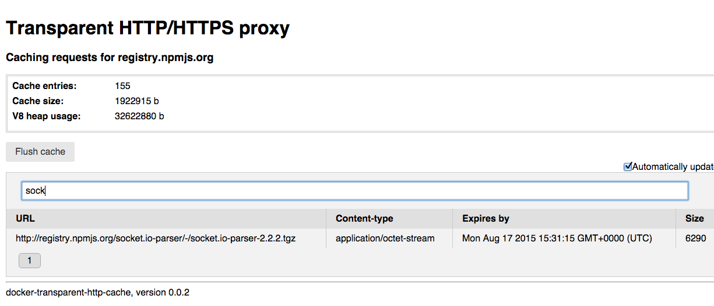

docker-transparent-http-cache
========

In-memory transparent HTTP/HTTPS caching proxy. General purpose in nature, but specifically designed/tested for
caching artifact downloads in Docker build containers.

## Usage

First build and launch the docker-transparent-http-cache image:

    $ docker build -t docker-transparent-http-cache .

    $ docker run -d --name cache-for-registry.npmjs.org \
    --env TARGET_HOSTNAME=registry.npmjs.org \
    docker-transparent-http-cache

Now can any container get all requests for `registry.npmjs.org` cached simply by linking to the cache container!

    $ docker run -it --rm -e bash \
    --link cache-for-registry.npmjs.org:registry.npmjs.org \
    node:0.12 \
    -c 'git clone https://github.com/mochajs/mocha.git; cd mocha; npm --strict-ssl false install'

The `strict-ssl false` option is required since npm by default will use `https://` when downloading, and the certificate
docker-transparent-http-cache serves is signed by a self signed CA certificate that is not included in node's ca bundle.

A nicer solution than `strict-ssl false` is to install the CA certificate intself as a trusted ca bundle:

    $ npm config cafile rootCA.pem

Above command of course goes into the provisioning/Dockerfile of your private build image!

## Environment variables

    TARGET_HOSTNAME - The hostname of the cache's target
    TTL - How long requests will live in the cache (default 60 seconds)
    MAX_SIZE - The greatest size the cache can grow to (overflowing cache entries are flushed on a LRU bases)

## Admin UI
A simple user interface for the cache is provided:

## Notes

Will only cache GET requests, other verbs are passed straight through. Deploying/pushing artifacts will thus be unaffected.

Caches by default HTTP on port 80 and HTTPS on port 443 on `TARGET_HOSTNAME`.

## Credits

Code base is originally from npm-proxy-cache.

## Why can't I use the built-in npm/maven/pip/gem/what-ever-cache?

Containerized scenario builds typically takes place in ephemeral containers that have no pre-populated
caches. One could re-use containers from build to build but that would undermine many of the very advantages
that comes with containerizaton (as improved build isolation, build reproducibility, etc.)

Using a seperate longer-running container for caching downloads of artifacts reduces build times while managing the
negative sides of caching.

## What does transparent mean? Why no just set the soo familiar http_proxy/https_proxy environment variables?

As this is a *transparent* http proxy is it possible to instrument the build containers to use the cache
in an entirely agnostic way using the network linking feature of Docker:

    --link cache-containter-for-registry.npmjs.org:registry.npmjs.org

Also, with docker-transparent-http-cache there is no need to worry about dynamic ip-adresses, IPtables, etc. It's all
being taken care of! And the build container will not even know that its requests are beeing cached.

## Why not use dockerized squid/varnish?

There were [pre-existing projects](https://github.com/jpetazzo/squid-in-a-can) that bundled heavy weight caching
solution as a docker container, e.g. Squid.

Squid for sure has more features than this project ever will.

However docker-transparent-http-cache:

 * is lean (at its core: ~100 lines of approachable hackable node js code)
 * works transparently out-of-the-box, no iptables setup required
 * dynamically creates certificate with correct CN/Common Name when proxying TLS traffic, the
   certificate is signed by a self signed CA certificate (rootCA.pem) that is included with the distribution
   and ready to be imported into the truststore/ca-bundle of a "victim"

----

Any feedback is welcome
